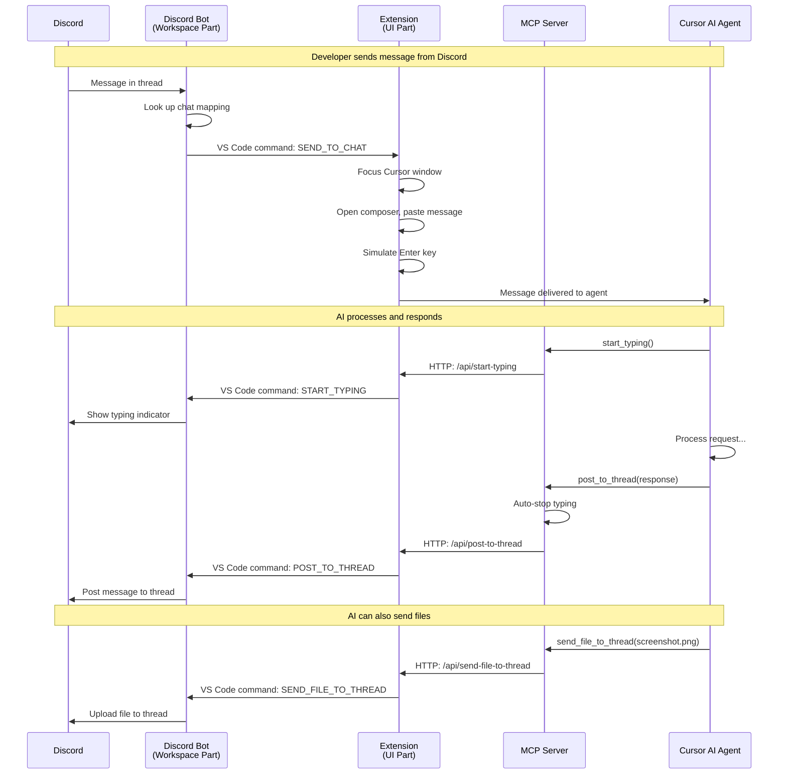

# Discord Cursor Bridge

A bidirectional bridge between Discord and Cursor AI agent chats. Communicate with your AI agents through Discord threads while working in Cursor.

## Features

- **Automatic Thread Creation**: New Cursor agent chats automatically get Discord threads
- **Discord Slash Commands**: Use `/new-agent` in Discord to start new Cursor agent chats
- **Bidirectional Messaging**: Messages flow both ways between Discord and Cursor
- **Thread Archiving Sync**: Archive/unarchive chats in Cursor → Discord threads follow
- **Implicit Archiving**: Old, untouched threads auto-archive based on configurable thresholds
- **Explicit Discord Archiving**: Manually close threads in Discord; they won't auto-reopen
- **Interactive Questions**: AI can ask questions with clickable Discord buttons
- **File & Image Sharing**: AI can send screenshots and files to Discord
- **Typing Indicators**: See when the AI is processing your request
- **Per-Project Channels**: Each project gets its own Discord channel
- **Thread Notifications**: Configurable user invites and pings for new threads
- **Simple Setup**: Install extension, configure once, works automatically
- **Remote Development Support**: Works with VS Code Remote (Coder, SSH, etc.)
- **Bundled MCP**: No separate MCP server setup required

## Communication Flow



## Architecture

The extension uses a split UI/Workspace architecture to support both local and remote development:

```
┌──────────────────────────────────────────────────────────────────┐
│                      Local Machine                                │
│  ┌────────────────────────────────────────────────────────────┐  │
│  │                  UI Extension Part                          │  │
│  │  ┌───────────────┐  ┌──────────┐  ┌─────────────────────┐ │  │
│  │  │  HTTP Server  │  │  Status  │  │  Config Manager     │ │  │
│  │  │   (for MCP)   │  │   Bar    │  │  (token, settings)  │ │  │
│  │  └───────┬───────┘  └──────────┘  └─────────────────────┘ │  │
│  │          │                                                  │  │
│  │  ┌───────┴───────┐  ┌────────────────────────────────────┐ │  │
│  │  │  Bundled MCP  │  │  Key Simulation (auto-submit)      │ │  │
│  │  │    Server     │  │  (AppleScript/PowerShell/xdotool)  │ │  │
│  │  └───────────────┘  └────────────────────────────────────┘ │  │
│  └────────────────────────────────────────────────────────────┘  │
└──────────────────────────────────────────────────────────────────┘
                              │
                    VS Code Commands
                              │
┌──────────────────────────────────────────────────────────────────┐
│                Remote Machine (or Local)                          │
│  ┌────────────────────────────────────────────────────────────┐  │
│  │               Workspace Extension Part                      │  │
│  │  ┌─────────────────┐  ┌──────────────────────────────────┐ │  │
│  │  │  Discord Bot    │  │  Chat Watcher                     │ │  │
│  │  │  (connects,     │  │  (detects new agents,             │ │  │
│  │  │   sends/recv)   │  │   creates threads)                │ │  │
│  │  └────────┬────────┘  └──────────────────────────────────┘ │  │
│  └───────────┼────────────────────────────────────────────────┘  │
│              │                                                    │
│              ▼                                                    │
│     ┌─────────────────┐                                          │
│     │    Discord      │                                          │
│     │  (your server)  │                                          │
│     └─────────────────┘                                          │
└──────────────────────────────────────────────────────────────────┘
```

## Quick Start

### 1. Discord Bot Setup

1. Go to [Discord Developer Portal](https://discord.com/developers/applications)
2. Create a new application and add a Bot
3. Enable these intents: **Message Content**, **Server Members**
4. Copy the bot token
5. Invite bot to your server using the OAuth2 URL with `Send Messages`, `Create Public Threads`, `Attach Files` permissions

### 2. Install Extension

```bash
# Clone and build
git clone <repo>
cd discord-llm-conversation
pnpm install
pnpm build

# Install in Cursor
# Cmd+Shift+P → "Developer: Install Extension from Location"
# Select: packages/cursor-extension
```

### 3. Configure

1. Restart Cursor after installing
2. Click the **Discord Setup** status bar item (or Cmd+Shift+P → "Discord Bridge: Open Settings")
3. Enter your Discord bot token
4. Select your Discord server (guild)
5. Create a channel for your project

The extension automatically configures `~/.cursor/mcp.json` with the bundled MCP server.

### 4. Start Chatting!

1. **Start a new agent chat** in Cursor → A Discord thread is automatically created
2. **Message in the thread** → The message is sent to your Cursor agent
3. **Agent responds** → Uses `post_to_thread` tool to reply in Discord

**Or start from Discord:**
1. Use `/new-agent` in your project channel
2. Enter your prompt in the modal
3. A new Cursor agent chat opens with your prompt, and a thread is created

## MCP Tools

The AI agent has access to these tools:

| Tool | Description |
|------|-------------|
| `get_my_thread_id` | Get the Discord thread ID for this agent session |
| `forward_user_prompt` | Forward Cursor prompts to Discord (for visibility) |
| `post_to_thread` | Post a message to the Discord thread |
| `send_file_to_thread` | Send a file or image to Discord |
| `start_typing` | Show typing indicator while processing |
| `stop_typing` | Stop the typing indicator |
| `ask_question` | Ask a question with interactive button options |
| `create_conversation_thread` | Create a new thread for a topic |
| `rename_thread` | Rename the current thread |
| `check_discord_messages` | Check for new messages from the developer |

### Typing Indicator

The AI can show a typing indicator while working on your request:

```
Developer sends message → AI calls start_typing → AI processes → AI calls post_to_thread (typing auto-stops)
```

The typing indicator refreshes automatically every 8 seconds until the AI posts a response.

### Discord Slash Commands

Start new agent chats directly from Discord:

```
/new-agent
```

A modal appears where you can enter your initial prompt. The extension:
1. Creates a new agent chat in Cursor
2. Sends your prompt to the agent
3. ChatWatcher automatically creates a Discord thread

**Multi-Window Support**: If you have multiple Cursor windows open (different projects), the command only responds in the channel configured for that project.

### Interactive Questions

The AI can ask questions with clickable Discord buttons:

```typescript
await ask_question({
  thread_id: "...",
  question: "Which approach should I use?",
  options: [
    { id: "a", label: "Refactor existing code" },
    { id: "b", label: "Create new abstraction" }
  ]
});
// Returns: { responseType: "option", selectedOptionIds: ["a"] }
// Or user can type a custom text response
```

### Sending Files

The AI can send screenshots, code files, or any other files:

```typescript
// Example: AI takes a screenshot and sends it
await browser_take_screenshot({ filename: "screenshot.png" });
await send_file_to_thread({ 
  file_path: "/path/to/screenshot.png",
  description: "Here's what the page looks like"
});
```

## Settings Panel

Access via status bar click or `Cmd+Shift+P → "Discord Bridge: Open Settings"`.

### Connection Tab
- **Bot Token**: Securely stored Discord bot token
- **Discord Server**: Select which server to use
- **Project Channel**: Create or select a channel for this project

### Notifications Tab
- **Thread Invite Users**: Users to automatically add to new threads
- **Ping Mode**: When to ping users (always, never, or on Discord conversation)

### Behavior Tab
- **Keep top N recent chats active**: Number of most recent chats to keep Discord threads open for
- **Keep active if used within X hours**: Time threshold for auto-archiving

### Logs Tab
- View activity logs for debugging

## Thread Lifecycle

### Automatic Thread Creation
When you start a new agent chat in Cursor:
1. ChatWatcher detects the new composer
2. Waits for the chat to receive a name (first message)
3. Creates a Discord thread with that name
4. Notifies configured users

### Archive Sync
- **Archive in Cursor** → Discord thread closes
- **Unarchive in Cursor** → Discord thread reopens
- **Close thread in Discord** → Marked as "explicitly archived", won't auto-reopen
- **Send message to closed thread** → Clears explicit archive, can auto-reopen again

### Implicit Archiving
Threads for old chats that haven't been explicitly archived in Cursor but are "stale" will stay archived in Discord based on:
- Number of more recent chats (configurable)
- Time since last activity (configurable)

## Development

```bash
# Install dependencies
pnpm install

# Build all packages
pnpm build

# Watch mode for extension TypeScript
cd packages/cursor-extension && pnpm dev

# Build webview (React settings panel) separately
cd packages/cursor-extension && pnpm build:webview
```

### Webview Development

The settings panel is a React application bundled with esbuild. It uses:
- **CSS Modules** for scoped component styling (`.module.css` files)
- **Global CSS** for base styles and CSS variables (`global.css`)
- **Component-per-file** architecture with shared reusable components

To modify the settings UI:
1. Edit files in `packages/cursor-extension/webview-ui/src/`
2. Run `pnpm build:webview` to rebuild
3. Reload Cursor window to see changes

## Project Structure

```
packages/
├── cursor-extension/         # VS Code/Cursor extension
│   ├── src/
│   │   ├── extension.ts          # Main entry (delegates to ui/workspace)
│   │   ├── ui/                   # UI part (runs locally)
│   │   │   ├── extension.ts      # UI activation
│   │   │   ├── httpServer.ts     # HTTP API for MCP
│   │   │   ├── configManager.ts  # Token/config storage
│   │   │   ├── statusBar.ts      # Status bar UI
│   │   │   ├── webviewPanel.ts   # Settings panel (serves React app)
│   │   │   ├── keySimulation.ts  # Auto-submit (AppleScript/etc)
│   │   │   └── messageHandler.ts # Sends messages to agents
│   │   ├── workspace/            # Workspace part (runs remotely or locally)
│   │   │   ├── extension.ts      # Workspace activation
│   │   │   ├── discordClient.ts  # Discord bot client
│   │   │   ├── chatWatcher.ts    # Detects new agent chats
│   │   │   ├── cursorStorage.ts  # Reads Cursor's internal SQLite DB
│   │   │   └── cursorRules.ts    # Auto-creates .cursor/rules for AI
│   │   └── shared/               # Shared types/commands
│   │       ├── commands.ts       # Internal command definitions
│   │       └── types.ts          # Shared types
│   ├── webview-ui/               # React settings panel
│   │   ├── src/
│   │   │   ├── index.tsx         # Entry point
│   │   │   ├── App.tsx           # Main app component
│   │   │   ├── global.css        # CSS variables, base styles
│   │   │   ├── App.module.css    # App-specific styles
│   │   │   ├── types.ts          # Message/state types
│   │   │   ├── vscode.ts         # VS Code API wrapper
│   │   │   └── components/
│   │   │       ├── ConnectionTab.tsx    # Bot token, server, channel setup
│   │   │       ├── NotificationsTab.tsx # User invites, ping settings
│   │   │       ├── BehaviorTab.tsx      # Auto-archive settings
│   │   │       ├── LogsTab.tsx          # Activity logs
│   │   │       └── shared/              # Reusable UI components
│   │   │           ├── Button.tsx       # Primary/secondary/danger buttons
│   │   │           ├── Callout.tsx      # Info/warning callouts
│   │   │           ├── Section.tsx      # Form section wrapper
│   │   │           ├── Tabs.tsx         # Tab navigation
│   │   │           └── ...              # Row, HelpText, StatusIndicator, etc.
│   │   └── esbuild.js            # Build config (CSS modules support)
│   ├── mcp/                      # Bundled MCP server
│   │   └── server.ts             # MCP tool definitions (thin proxy)
│   └── package.json
└── docs/
    └── future-architecture.md    # Planning for multi-connector support
```

## Data Storage

The extension stores data in VS Code's built-in storage:

| Data | Storage | Scope |
|------|---------|-------|
| Bot token | `secretStorage` | Global (all workspaces) |
| Guild/server config | `globalState` | Global |
| Chat↔Thread mappings | `workspaceState` | Per-workspace |
| Thread activity timestamps | `workspaceState` | Per-workspace |
| Explicitly archived threads | `workspaceState` | Per-workspace |
| Seen/archived chat IDs | `workspaceState` | Per-workspace |

**Workspace isolation**: Each project has its own chat mappings and thread state. Opening a different project won't interfere.

## Remote Development

This extension fully supports VS Code Remote (SSH, Containers, Coder, etc.):

- **UI Part**: Always runs on your local machine
  - Handles MCP communication, key simulation for auto-submit
  - Manages secure token storage
  - Focuses Cursor window when receiving Discord messages
- **Workspace Part**: Runs where your code is (remote or local)
  - Manages Discord bot connection
  - Watches for new agent chats
  - Handles typing indicators and file uploads

Communication between parts uses VS Code commands, which work transparently across the local/remote boundary.

## Troubleshooting

### Messages paste but don't send
- Ensure Cursor has accessibility permissions (macOS: System Settings → Privacy & Security → Accessibility)
- The extension automatically focuses Cursor before sending, but check if another app is stealing focus

### Typing indicator not showing
- Make sure the Discord bot has permission to send messages in the thread
- Check the extension output panel for errors

### Files not uploading
- Ensure the file path is absolute
- Check that the Discord bot has `Attach Files` permission

### Threads not auto-archiving
- Check the Behavior tab settings in the Settings panel
- Verify implicit archive count and hours are configured

### Thread keeps reopening after I close it
- The extension tracks "explicit" vs "auto" archives
- Closing a thread in Discord marks it as explicitly archived
- If it still reopens, check if a new message was sent (which clears the explicit flag)

## License

MIT
