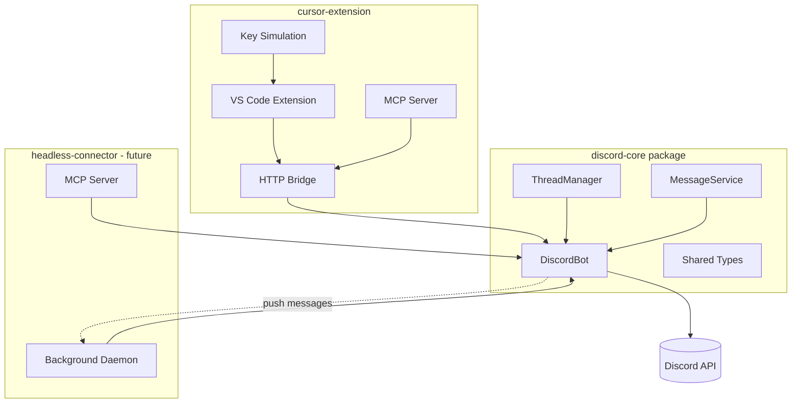

# Future Architecture: Multi-Connector Discord Bridge

This document captures research and planning for a potential future refactor that would extract the core Discord functionality into a reusable package, enabling integration with multiple AI tools beyond Cursor.

## Motivation

The current implementation is tightly coupled to Cursor/VS Code. However, there's value in supporting other AI coding tools:

- **Claude Code** or similar CLI-based AI tools
- **Headless/cloud environments** where there's no GUI
- **Other IDEs** that might want Discord integration

The core Discord functionality (bot connection, thread management, messaging) is generic and could be reused across different integrations.

## Current Architecture

Everything is in `cursor-extension`:

```
packages/cursor-extension/
├── src/
│   ├── ui/                    # Cursor-specific: key sim, status bar, webview
│   ├── workspace/             # Discord client (reusable) + chat watcher
│   └── shared/                # Types and commands
└── mcp/                       # MCP server (proxies through HTTP to extension)
```

## Proposed Architecture

Split into reusable core + connector-specific packages:

```
packages/
├── discord-core/              # Pure Discord functionality (reusable)
│   ├── src/
│   │   ├── client.ts          # Discord.js wrapper, connection management
│   │   ├── threads.ts         # Thread creation, management, mapping
│   │   ├── messaging.ts       # Send text, files, embeds, typing indicators
│   │   └── types.ts           # Shared types (ChatMapping, etc.)
│   └── package.json
│
├── cursor-extension/          # Cursor/VS Code specific
│   ├── src/
│   │   ├── ui/                # Key simulation, status bar, webview, HTTP server
│   │   └── workspace/         # Uses discord-core, chat watcher
│   └── mcp/                   # MCP server (proxies through HTTP)
│
└── headless-connector/        # Future: standalone for Claude Code, etc.
    ├── src/
    │   └── daemon.ts          # Background process, embeds discord-core directly
    └── mcp/                   # MCP server (talks directly to Discord, no HTTP proxy)
```

## Architecture Diagram



## What Goes Where

### discord-core (Reusable)

| Component | Description |
|-----------|-------------|
| `DiscordClient` | Discord.js wrapper with connect/disconnect/reconnect |
| `ThreadManager` | Create threads, store chat↔thread mappings |
| `MessageService` | Send text, files, embeds to threads |
| `TypingIndicator` | Start/stop typing with auto-refresh |
| `EventEmitter` | Emit events for incoming messages |
| `Types` | `ChatMapping`, `ThreadInfo`, config interfaces |

### Connector-Specific

| Component | Cursor Extension | Headless Connector |
|-----------|------------------|-------------------|
| **Config Storage** | VS Code SecretStorage | Environment vars or config file |
| **Message Delivery** | Paste into composer + key simulation | Direct callback or polling |
| **MCP Communication** | HTTP proxy to extension | Direct to Discord client |
| **UI** | Status bar, webview panel | CLI output or none |
| **Lifecycle** | VS Code extension activate/deactivate | Daemon start/stop |

## Open Problems

### 1. Message Delivery in Headless Mode

When a Discord message comes in, how does the AI receive it?

**Option A: Polling**
- AI periodically calls `check_messages` MCP tool
- Simple but adds latency and unnecessary API calls
- Works with any AI tool that supports MCP

**Option B: Long-running daemon with callbacks**
- Daemon watches Discord and triggers AI when messages arrive
- Lower latency, more efficient
- Requires the AI tool to support external triggers or be long-running

**Option C: AI tool-specific integration**
- Claude Code might have specific mechanisms for async input
- Would need to research each tool's capabilities

### 2. Session Persistence

- How does a headless connector know which "conversation" a Discord message belongs to?
- Cursor uses chat IDs from the composer; headless would need a different approach
- Possibly: one Discord thread = one AI session, daemon maintains mapping

### 3. Configuration

- Cursor uses VS Code's SecretStorage for the bot token
- Headless would need: environment variables, config file, or a setup command

### 4. Multiple Concurrent Sessions

- Cursor naturally handles this via multiple composer tabs
- Headless might need explicit session management

## Benefits

1. **Code Reuse** - Discord logic written once, used everywhere
2. **Easier Testing** - Core can be tested independently
3. **Cleaner Separation** - Clear boundaries between Discord and integration logic
4. **Future Extensibility** - Adding new AI tool support becomes straightforward
5. **Maintenance** - Bug fixes in core benefit all connectors

## When to Implement

This refactor makes sense when:
- There's a concrete need for a second connector (e.g., Claude Code support)
- The headless AI tool's async message handling is understood
- The current implementation is stable and well-tested

## References

- Current implementation: `packages/cursor-extension/`
- Discord.js docs: https://discord.js.org/
- MCP specification: https://modelcontextprotocol.io/
